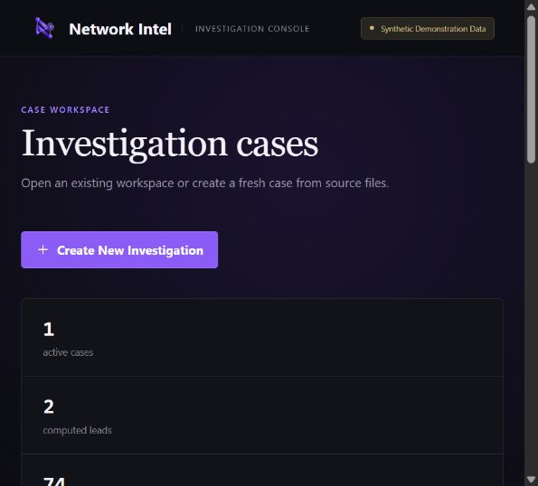
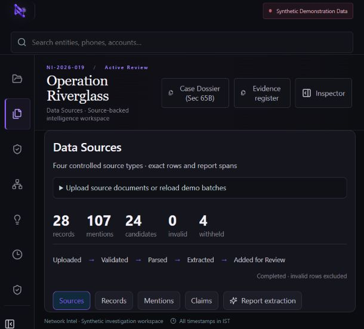
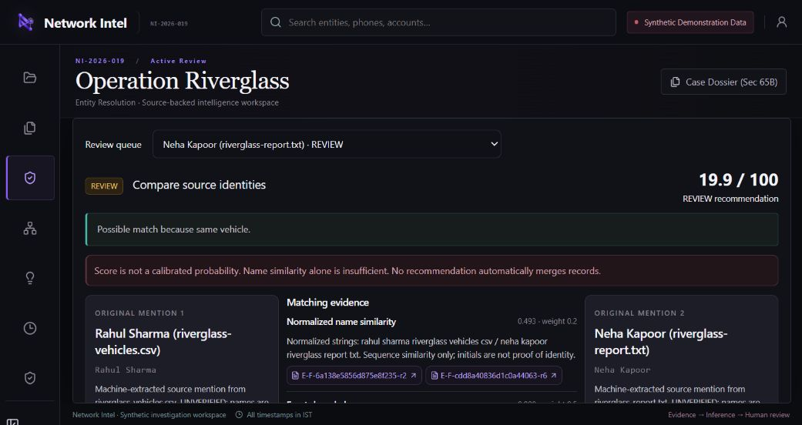
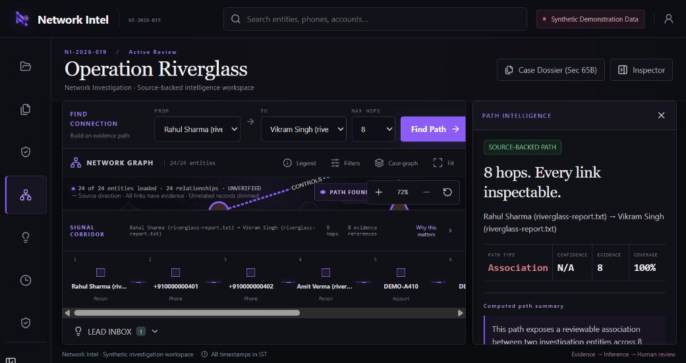
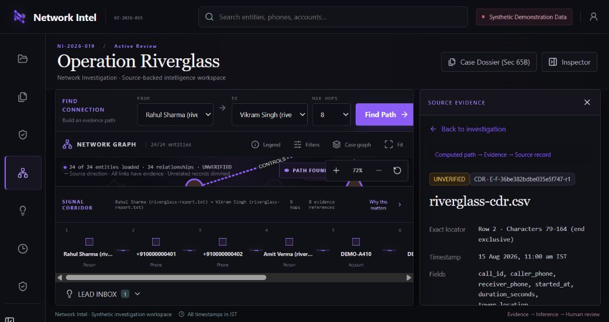
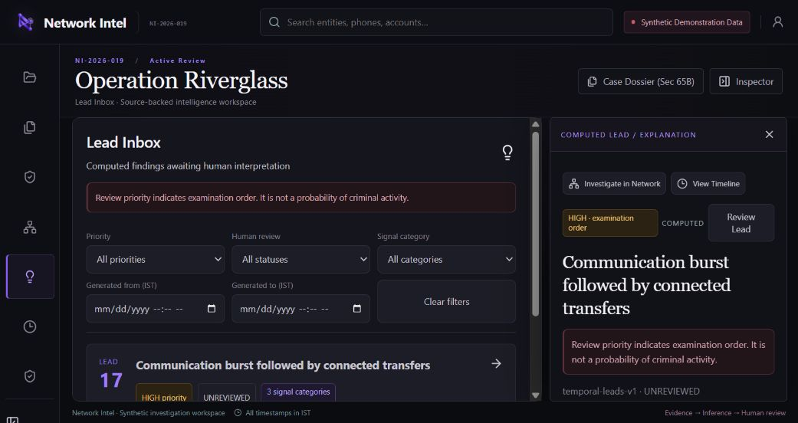
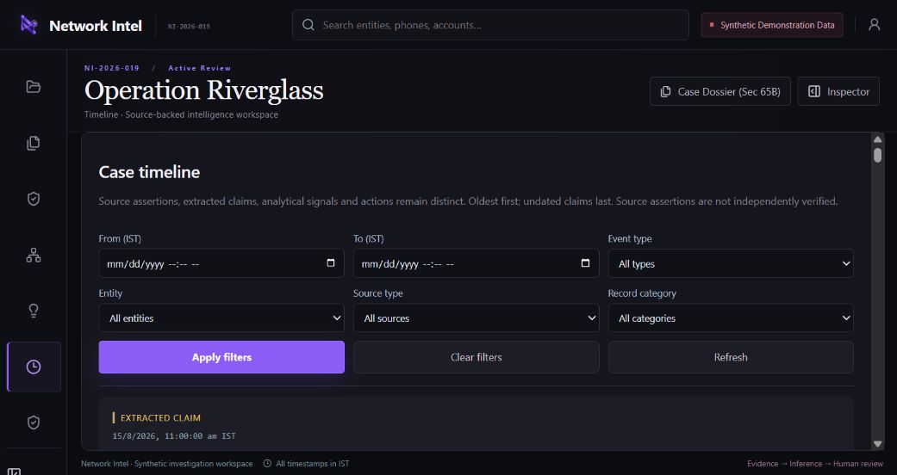
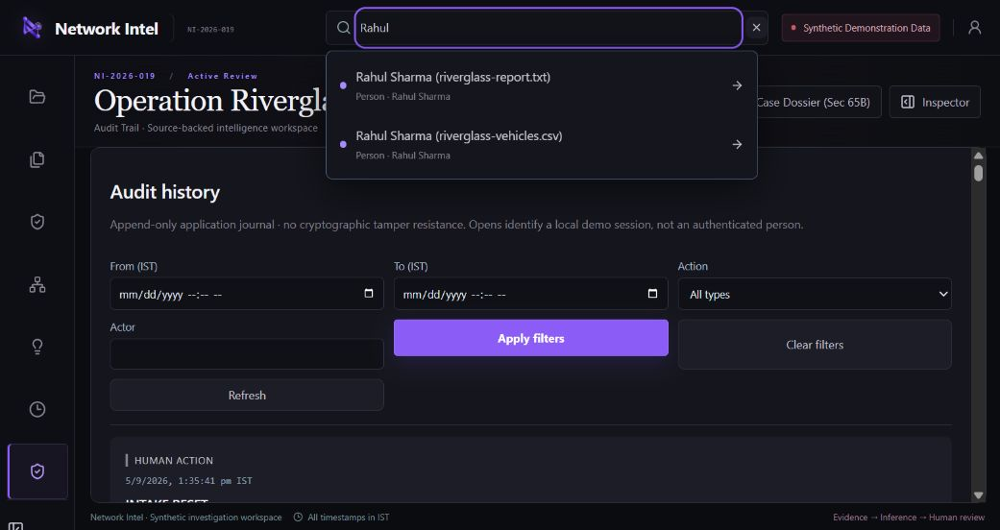
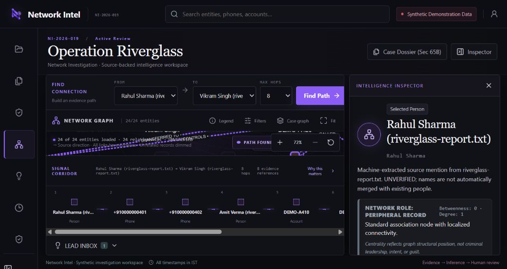
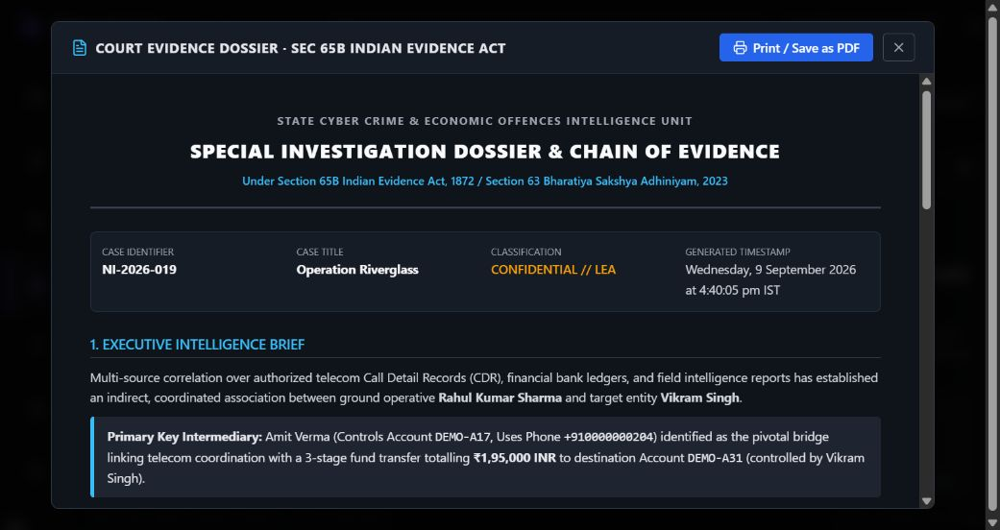

# Network Intel — Investigator-first audit

Date: 9 September 2026  
Scope: Current local SIH 26189 implementation at `http://127.0.0.1:8000/#/app`  
Method: Live UI walkthrough plus repository/API verification. No product code was changed during this audit.

## Executive verdict

Current product ka strongest capability hai: do apparently disconnected records ke beech bounded shortest path nikalna, har hop ka relationship type dikhana, aur ek click mein exact source row tak jaana. **This is core product value.**

Lekin present build ko real investigation ya court-facing output ke liye trust nahi kiya ja sakta. Sabse bada reason `Court Evidence Dossier` hai: usme hard-coded identities/IDs, current computed lead se inconsistent numbers, accusatory wording, aur unsupported legal/integrity certification hai. Is feature ko judge demo se turant hataana ya safe dynamic draft banana chahiye.

## 1. Investigator ko product kaise use karna padega

1. Case Hub se existing `Operation Riverglass` open kare ya `Create New Investigation` kare.
2. New case ke liye title, internal reference aur purpose enter kare.
3. `Data Sources` mein `.txt` report aur `.csv` CDR/Transaction/Vehicle files select kare.
4. Filename se source type infer hota hai: `.txt` = Report; CSV filename mein `cdr`, `transaction`, ya `vehicle` hona chahiye.
5. `Validate files`, phir `Process sources`.
6. Mentions/claims inspect kare, Entity Resolution queue review kare.
7. Network graph/path, Lead Inbox aur Timeline use kare.
8. Har important relation/lead se exact source evidence open kare.

### Accepted data — exact current boundary

- Report: UTF-8 `.txt`, line-by-line parsing.
- CDR CSV: call ID, caller phone, receiver phone, timezone-aware timestamp, duration, tower location.
- Transaction CSV: transaction ID, sender/receiver account, timezone-aware timestamp, amount, INR, channel.
- Vehicle CSV: record ID, vehicle number, relation, person, timezone-aware observation, location, source type.
- UI limit: 64 KiB per file; backend JSON envelope limit: 400,000 bytes.
- PDF, image, OCR, email, audio, XLSX and database connectors are absent.
- Real identifiers are not generally supported: account IDs must match `DEMO-A...`; vehicle IDs must match `DEMO-VH-...`; call/transaction IDs also use controlled prefixes.

System uploads ko SHA-256 fingerprint karta hai, schema validate karta hai, exact records banata hai, deterministic identifiers extract karta hai, spaCy/EntityRuler se text candidates nikal sakta hai, candidate relations banata hai, resolution proposals generate karta hai, graph build karta hai, NetworkX path/centrality aur deterministic temporal signals calculate karta hai, aur optional Groq se structured findings explain karta hai.

### Output classes

- Direct source material: uploaded row/text excerpt, timestamp, field locator, checksum. UI ise bhi `UNVERIFIED` kehta hai; independent verification workflow absent hai.
- Algorithmic inference: shortest path, betweenness/degree role, new-contact signal, transfer sequence, graph-context signal.
- Lead/recommendation: HIGH/MEDIUM/LOW review priority, entity match suggestion, Groq explanation and proposed next action.

## 2. Realistic synthetic scenario — Operation Crosswind

### People and groups

Group A: Ayaan Khan, Ritesh Malhotra, Sana Qureshi, Mohit Rao.  
Group B: Kabir Ansari, Farah Sheikh, Dev Mehta, Nisha Kapoor.  
Hidden intermediary: Imran Sheikh, also appearing as `I. Sheikh`.  
Noise/benign: Rohan Gupta (phone-repair shop), Dr Meera Joshi. Total 11 people.

### Records

- 11 phone numbers; Ayaan's SIM repeatedly contacts Imran's SIM shortly before transfers.
- 6 synthetic accounts: `DEMO-A301` to `DEMO-A306`.
- 3 synthetic vehicles: `DEMO-VH-51`, `DEMO-VH-52`, `DEMO-VH-53`.
- Organisations: Meridian Freight, Crescent Exports, Rohan Electronics.
- Locations: East Freight Yard, Central Bus Stand, Dock Gate 4.
- Alias: `Kabir Ansari` / `K. Ansari`; supporting same phone and account evidence.
- Hidden corridor: Ayaan → phone → Imran/I. Sheikh → account 301 → 302 → 303 → Kabir's account → Kabir.
- Misleading hub: Rohan Electronics legitimately contacts many phones; high degree should not mean criminal importance.
- Noise: repair receipts, doctor appointment call, unrelated low-value UPI payments and repeated Central Bus Stand tower hits.

### Files received

`crosswind-report.txt`, `crosswind-cdr.csv`, `crosswind-transactions.csv`, `crosswind-vehicles.csv`.

This scenario fits the controlled prototype only after replacing real account/vehicle identifiers with `DEMO-*` formats. That itself is a real-world limitation.

## 3. Solving the case with the current product

| Step | Product action/result | Useful | Confusing / missing / dangerous |
|---|---|---|---|
| 1 | Four files upload and process | One case, multiple evidence types | Source type depends on filename; real identifiers/PDF rejected |
| 2 | Regex/CSV + NLP creates mentions and candidate claims | Fast first-pass extraction | Current persisted Riverglass run reports 107 mentions but zero spans/confidences; all methods appear `deterministic-rule` |
| 3 | Person, Phone, Account, Vehicle, Location, Organization nodes appear | Cross-source view | Same person stays duplicated by source until human resolution |
| 4 | CALLED, CONTROLS, TRANSFERRED_TO, etc. appear | Relationship context exists | Graph calls candidates `recorded` while verification remains `UNVERIFIED` |
| 5 | Graph focuses on selected/path nodes | Reduces manual tabulation | Default graph initially looks empty until path/case mode is used; long path needs horizontal scroll |
| 6 | Shortest path + temporal rule + centrality | Finds non-obvious corridor | Path is undirected/equal-cost; centrality labels can overstate importance |
| 7 | Hidden intermediary/cross-group account chain appears | **This is core product value** | An 8-hop path is an association, not chronology or intent |
| 8 | Click evidence ID; see exact CDR row, timestamp and fields | Strong verification handoff | No authenticated reviewer or evidence verification/sign-off state |
| 9 | Next action: obtain subscriber KYC, bank KYC/full ledger, device attribution, lawful CDR certificate, and corroborate locations | Converts lead into investigation plan | Product cannot currently track these requests or evidence gaps explicitly |

Actual Riverglass run found: Rahul Sharma → phone `...401` → phone `...402` → Amit Verma → `DEMO-A410` → `A420` → `A430` → `A440` → Vikram Singh. It used eight evidence-backed hops and a three-transfer sequence totalling ₹1,95,000 over 67 minutes.

## 4. Major features — investigator value

| Feature | Value | Why care? |
|---|---|---|
| Dashboard / Case Overview | HIGH VALUE | Immediately shows evidence sources, pending identity decisions and computed leads |
| Graph | HIGH VALUE | Cross-source relationships become navigable; path dimming reduces noise |
| Entity profile | HIGH VALUE | Shows source refs, connected records and centrality disclaimer |
| Relationship view | HIGH VALUE | Direction, type, timestamps and exact evidence are inspectable |
| Shortest path | HIGH VALUE | Best discovery feature; every hop is reviewable |
| Centrality | MISLEADING unless renamed | Mathematical role is useful, but `BRIDGE / FACILITATOR` and `Critical intermediary` sound investigative/criminal |
| Communities | LOW VALUE / NOT IMPLEMENTED | No community detection or cluster explanation exists |
| Alerts / Lead Inbox | HIGH VALUE | Combines communication, financial and graph-context signals without autonomous guilt score |
| Risk/priority score | MEDIUM VALUE | Review order is useful and explicitly not a probability; there is no true risk model |
| Filters | HIGH VALUE | Entity, relation, time, lead status/category and timeline filters exist |
| Timeline | HIGH VALUE | Separates extracted claims, analytical signals and human/system actions |
| Evidence panel | HIGH VALUE | Exact locator, row/span, fields and source excerpt are available |
| Upload/import | MEDIUM VALUE | Clear controlled flow, but extremely narrow formats and fragile filename inference |
| Search | HIGH VALUE | Fast entity lookup, but duplicate source identities are not visually grouped |
| Behavioral profiles / Isolation Forest | MISLEADING | Small synthetic population and unvalidated anomaly score can attract attention without reliable investigative meaning. **Good demo feature, low investigation value.** |
| Court Evidence Dossier | MISLEADING / TRUST-BREAKING | Hard-coded and unsupported legal claims; do not demo it in current form |

## 5. Skeptical investigator answers

- **Ye relation bana kaise?** Relationship inspector exposes type, direction, extraction method where available and evidence IDs. But current demo extraction provenance is stale/empty.
- **Source evidence kaha hai?** Evidence buttons open exact source record. This works well.
- **System ko kaise pata same person hai?** Name similarity plus exact shared phone/account/vehicle; no auto-merge. Investigator must Confirm/Reject.
- **Do same-name log hue to?** Name alone cannot strongly confirm, but it still creates review noise. Current similarity wrongly includes source-qualified filenames.
- **Important ya bas highly connected?** Centrality is only structure. Current disclaimer says this, but role copy still overstates `facilitator`/`critical intermediary`.
- **Score ka meaning?** Resolution `19.9/100` is weighted rule output, not calibrated probability. HIGH lead priority is review order, not risk.
- **Why trust alert?** Because each signal exposes threshold, calculation, limitations and evidence; not because of ML accuracy.
- **False positive?** Yes—shared phone/vehicle, ordinary payments, service hubs and missing data can all explain the same pattern.
- **Direct ya inferred?** Path screen says association and shows traversal. Graph edge status `recorded` versus `UNVERIFIED` is still semantically confusing.
- **Incomplete data?** Product has disclaimers, but no coverage/gap model; absence can still be overread.
- **NLP wrong?** Candidates stay unverified, but there is no dedicated Approve/Reject extraction workflow before graph construction.
- **Innocent large network?** Centrality may highlight it. No hub-type suppression/known-service tagging exists.
- **Timestamps/relation type?** Available for structured events and visible in Timeline/Relationship inspector; free-text claims may remain undated.

## 6. Most dangerous investigator-facing flaws

### 🔴 Trust-breaking

1. Court dossier contains hard-coded wrong/currently unsupported facts: `DEMO-A17`, `+910000000204`, `DEMO-A31`, 7 contacts and 75 minutes, while live lead uses other account IDs, 3 new contacts and 67 minutes.
2. Court dossier says `established coordinated association`, labels people `ground operative`/`target entity`, identifies a `Primary Key Intermediary`, and certifies systems as untampered/ordinary-course without evidence.
3. Current Riverglass persisted extraction state has 107 mentions but 0 populated character spans and 0 confidences; UI shows `characters null–null` despite claiming exact report spans.
4. Controlled regex rejects ordinary real account and vehicle identifiers. It is not currently usable on normal real-world source files.

### 🟠 Serious

1. Resolution name comparison includes filenames in normalized strings, distorting similarity.
2. A same vehicle alone creates Rahul-vs-Neha identity review despite strongly conflicting names.
3. `recorded` relationship status can be mistaken for verified fact even though every displayed item is `UNVERIFIED`.
4. Centrality reason says `Critical intermediary` and `potential operational coordinator`; mathematical position is not such a conclusion.
5. Groq output passed grounding but current `Why flagged?` returned only the caution text; valid does not mean useful.
6. Audit journal explicitly lacks cryptographic tamper resistance and authenticated identity.

### 🟡 Manageable

1. Eight-hop corridor is horizontally dense; intermediate labels are truncated.
2. Search shows duplicates without grouping or resolution status.
3. Timeline becomes noisy with repeated opens/resets and starts oldest-first.
4. No communities or evidence-gap view.
5. Small text, dense panels and icon-only collapsed navigation create accessibility/readability risk.

### 🟢 Minor

1. Some UI copy alternates `USES` and `USED_PHONE` semantics in existing persisted data.
2. Court dossier close button has no accessible name in the current accessibility tree.

## 7. FACT vs INFERENCE vs HYPOTHESIS

Current UI is directionally good: Timeline has `EXTRACTED_CLAIM`, `ANALYTICAL_SIGNAL`, `HUMAN_SYSTEM_ACTION`; path explicitly says it is not causation; lead priority says it is not probability.

But it is not fully clear:

- Uploaded row = **SOURCE ASSERTION**, not automatically verified fact.
- Human-verified row/claim = **VERIFIED FACT**; this state/workflow does not currently exist.
- Path/centrality/temporal calculation = **INFERENCE**.
- Lead or entity-match suggestion = **HYPOTHESIS / REVIEW ITEM**.

Fix: use these four badges consistently on graph edges, Timeline, search, inspector and export. Never call an extracted graph candidate `recorded` without pairing it with `UNVERIFIED SOURCE ASSERTION`. Add an investigator verification decision with reviewer, reason and timestamp before any item becomes `VERIFIED FACT`.

## 8. Graph test

- Understand in 10 seconds: partially; focused-path mode yes, full graph no.
- Filter relationship type: yes.
- Hide irrelevant nodes: path dimming/entity filters yes; manual hide/pin absent.
- Focus on one entity: yes through search/inspector.
- Shortest connection: yes, up to 8 hops.
- Trace source evidence: yes, excellent.
- Dates: in inspector/timeline and time filters; not clearly printed on graph edges.
- Strong vs weak links: verification line styles exist, but all current data is unverified and no calibrated strength exists.
- Communities: no.
- Why highlighted: centrality/role panel exists, wording needs neutralisation.

## 9. Ideal workflow and current availability

| Ideal step | Current state |
|---|---|
| Open/create case | Exists |
| Upload original evidence | Exists, controlled CSV/TXT only |
| Validate schema + fingerprint | Exists |
| Extract entities/relations | Exists |
| Review/approve extracted candidates | Partial: visible, no explicit approve/reject gate |
| Resolve duplicate identities | Exists with reversible human decision |
| Build graph from approved assertions | Partial: graph builds from candidates before investigator approval |
| Detect temporal/path patterns | Exists |
| Investigate one lead | Exists |
| Verify every supporting source | Inspect exists; verified/sign-off state absent |
| Record decision and evidence gaps | Lead decision exists; gap/request tracking absent |
| Generate safe investigation summary | AI explanation exists; court dossier is unsafe |
| Export defensible bundle | Not defensible until dossier and chain-of-custody issues are fixed |

## 10. Top five missing things

“I have the graph, but I still need…”

1. authenticated source verification and chain-of-custody state;
2. correct dynamic summary/export with zero hard-coded facts;
3. working extraction provenance plus explicit candidate approval;
4. real identifier/schema support, PDF/OCR and larger-file ingestion;
5. evidence-gap/request tracking with KYC, subscriber/device attribution and location corroboration.

## 11. Investigator WOW moment

Yes. `Rahul → phones → Amit → four-account transfer chain → Vikram`, followed by one-click exact CDR/transaction rows, is a genuine “manual work mein miss ho sakta tha” moment. **This is core product value.**

The WOW is not the visual graph alone. It is `Find path → isolate corridor → inspect each hop → open original row`.

## 12. Two-to-three minute judge demo

1. **Click:** Operation Riverglass → Open investigation.  
   **Say:** “Imagine main four unconnected evidence files receive karta hoon—report, CDR, bank transactions aur vehicle observations.”
2. **Click:** Data Sources.  
   **Show:** 28 records, 107 mentions, 24 candidates, 4 withheld; synthetic-data badge.  
   **Say:** “System source rows ko preserve karke extraction candidates banata hai; ye abhi verified facts nahi hain.”
3. **Click:** Network. Select Rahul Sharma and Vikram Singh → Find Path.  
   **Show:** 8-hop corridor and 8 evidence references.  
   **Say:** “Dono ka direct link nahi tha. System ne phones, Amit Verma aur account chain ke through explainable connection nikala.”
4. **Click:** first evidence ID.  
   **Show:** filename, exact row/character locator, timestamp, fields.  
   **Say:** “Graph ka har hop original record tak trace hota hai. Path lead hai, guilt proof nahi.”
5. **Click:** Lead Inbox → Lead 17.  
   **Show:** new contacts + ₹1,95,000 transfer sequence + graph context; grounded explanation and caution.  
   **Say:** “System priority sirf review order hai. Investigator evidence verify karke decision record karta hai.”

Do not open Behavioral Profiles or Court Dossier in the current judge demo.

## 13. Investigator verdict

| Category | Score /10 |
|---|---:|
| Ease of investigation | 6.5 |
| Data usefulness | 6.0 |
| Graph usefulness | 7.5 |
| Evidence traceability | 7.5 |
| Explainability | 6.5 |
| Trustworthiness | 3.5 |
| False-positive safety | 6.0 |
| Investigation speed improvement | 7.0 |
| Real-world usability | 3.5 |
| Overall investigator value | 5.8 |

Would I use it? **Only with changes.**

Biggest use reason: evidence-backed shortest-path corridor substantially reduces manual cross-referencing.

Biggest distrust reason: court dossier invents/hard-codes conclusions and certifies legal/integrity facts the system cannot establish.

Top three trust fixes:

1. remove/rebuild Court Dossier from live validated data with neutral draft wording;
2. repair provenance and add human verification gate before candidate edges become facts;
3. fix entity resolution to compare clean identity names and require stronger contradictory-name safeguards.

Top three existing valuable features:

1. shortest path with one evidence record per hop;
2. exact source evidence inspector and Timeline separation;
3. deterministic multi-category Lead Inbox with limitations and human review.

## Screenshot evidence

### Step 1 — Case entry — healthy

### Step 2 — Data sources — useful, constrained

### Step 3 — Entity resolution — serious scoring/data-quality concerns

### Step 4 — Hidden path — core value

### Step 5 — Source evidence — core value

### Step 6 — Lead explanation — useful but quality-variable

### Step 7 — Timeline — useful, noisy at scale

### Step 8 — Search — fast but exposes unresolved duplicates

### Step 9 — Entity profile — useful with centrality-language risk

### Step 10 — Court dossier — trust-breaking

## Evidence and accessibility limits

This was a live UI and code/API audit, not a field validation with real police datasets. Screenshot evidence confirms visible hierarchy and copy, not full WCAG compliance. Accessible names, headings and form labels are generally present; keyboard graph operation is provided through equivalent selectors/search rather than direct canvas navigation. Screen-reader flow, contrast ratios, 200% zoom and long-session performance still require dedicated testing.
