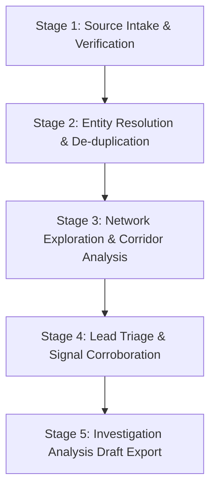

# Network Intel — Practical Investigator Workflow Guide

This document outlines the standard operating procedure (SOP) for criminal intelligence analysts and investigating officers using Network Intel.

---

## 1. The Investigative Problem
In modern financial crime, narcotics, and organized fraud investigations, investigators face fragmented, heterogeneous datasets:
- Free-text intelligence dispatches and informant memos
- Telecommunication CDRs (hundreds of rows, tower IDs, call durations)
- Bank statements (NEFT/IMPS/UPI transaction ledgers)
- Regional transport authority vehicle observations

Connecting the dots manually requires cross-referencing paper logs or disconnected spreadsheets, leading to overlooked links, cognitive bias, and unverifiable assumptions.

---

## 2. The 5-Stage Investigative Lifecycle

### Stage 1: Source Ingestion & Provenance Recording
1. **Upload Case Evidence:**
   - Place source CSVs and TXT dispatches into the case folder or use the Data Sources intake panel.
   - The system validates file checksums (SHA-256) and parses rows into atomic, immutable records.
2. **Review Extracted Mentions:**
   - Check extracted entity mentions. Every mention is marked `EXTRACTED_UNVERIFIED` by default.
   - Hover or click on mentions to inspect the exact line, character span, and raw source text excerpt.

### Stage 2: Conservative Entity Resolution
1. **Inspect Match Proposals:**
   - The system flags candidate entity pairs sharing phone numbers, bank accounts, or compatible name spellings.
   - Clean names are compared (source tags like `(report.txt)` are stripped automatically).
2. **Evaluate Evidence & Conflicts:**
   - Check supporting evidence vs absent signals.
   - Note that shared vehicles provide corroboration (score = 0.100), not personal identity proof.
   - Conflicting surnames incur heavy penalties.
3. **Record Human Decision:**
   - **Confirm Match:** Merges records into a canonical node in the projected view; original evidence remains intact.
   - **Reject / Defer:** Keeps entities separate with an audit record.
   - **Undo:** Available at any time to reopen the verification.

### Stage 3: Interactive Network Exploration
1. **Toggle Verification Gate:**
   - Use the **"Verified only"** toggle in the network graph toolbar to hide speculative machine links and inspect only human-verified associations.
2. **Trace Corridors:**
   - Select Anchor Entity (e.g. `Tariq Khan`) and Target Entity (e.g. `Aman Verma`).
   - Run **"Find Path"** (up to 8 hops). The system highlights the exact multi-modal sequence (calls → transactions → vehicle sightings).
3. **Inspect Edges:**
   - Solid green = Investigator verified.
   - Thick teal = Corroborated across independent sources.
   - Dashed grey = Unverified source assertion.
   - Dotted purple = Algorithmic candidate.

### Stage 4: Lead Triage & Corroboration
1. **Examine Lead Priorities:**
   - Open **Lead Inbox**. Sort by priority (`HIGH`, `MEDIUM`, `LOW`).
   - Priority reflects review urgency, not guilt.
2. **Review Structured Facts:**
   - Read `Why Flagged`, `Supporting Evidence`, `Who Was Involved`, and `What Remains Uncertain`.
3. **Check Grounded AI Explanation:**
   - Review the optional rephrased summary. Ensure all cited fact IDs align with evidence.

### Stage 5: Export Investigation Analysis Draft
1. Click **"Analysis Draft"**.
2. Review the structured summary, subject profiles, verified factual links, chain of custody, and recommended next operational steps.
3. Export markdown or print draft for internal case conference and warrant application prep.
