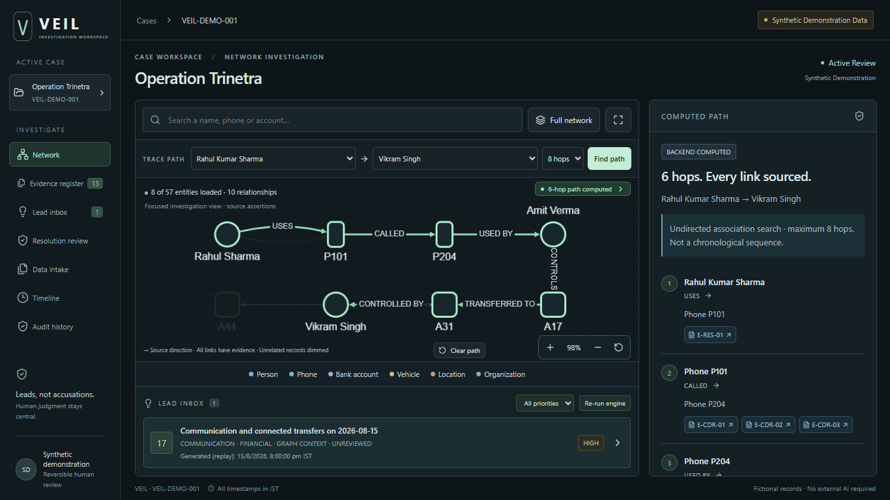
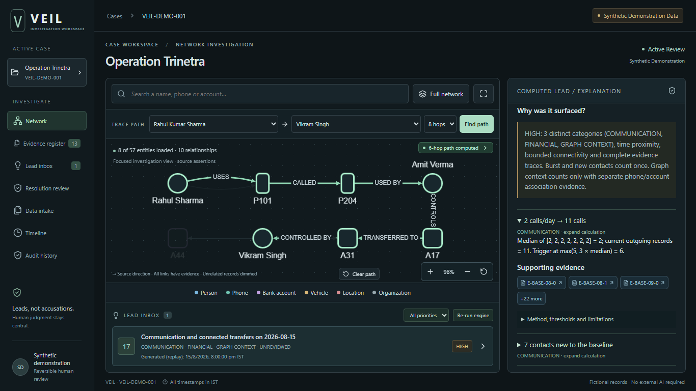
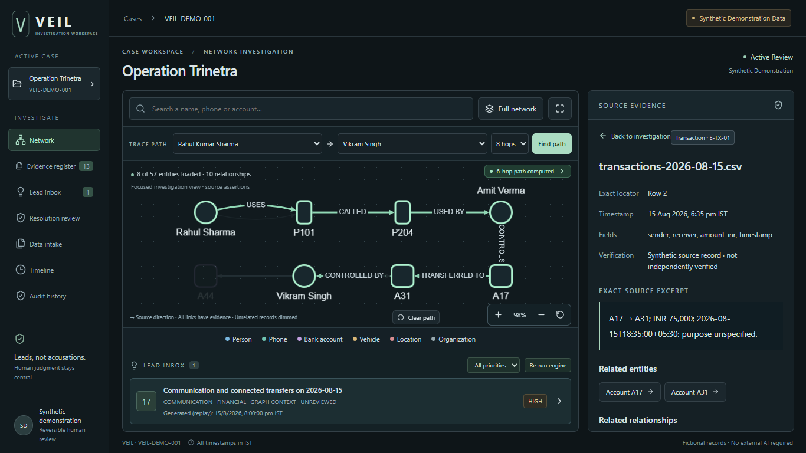
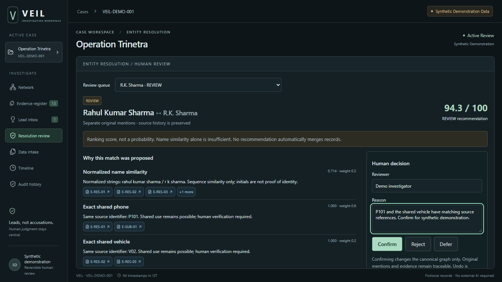
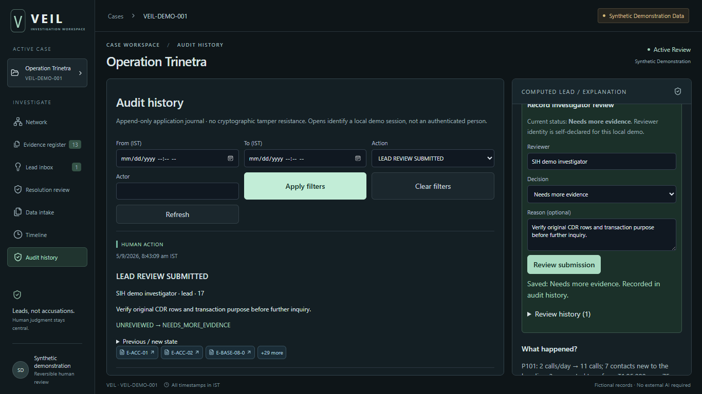

# Cycle 6: selection-quality UI and demo hardening

## 1. Implemented

Preserved the existing React/Cytoscape, FastAPI, NetworkX and SQLite prototype. The [product audit](../audits/CYCLE-6-AUDIT.md) classifies the visible screens and controls. The resolution review now exposes its evidence and decision controls together; intake shows all four processed source cards; setup controls and review forms use disclosures so explanations remain prominent. Evidence collections are explicitly distinguished from uploaded files.

The graph now has a stable lifecycle, deterministic layout, fit/zoom/reset controls, distinct selection and path states, direction indicators and evidence guidance. Canonical search results precede imported mentions. Drawers preserve the canvas while inspecting leads and exact evidence. Focus states, empty results and recoverable errors are covered by browser checks.

Added a production UI/API launcher, archived rehearsal reset, API exports, screenshot fallback and automated golden-flow smoke tests. No new analytical algorithm or major product capability was introduced.

## 2. Technical decisions

- Keep one Cytoscape instance; update changed graph data separately from selected state. Refit only when needed, including returning from the resolution screen. Fixed display anchors never determine an analytical path.
- Share concurrent GET requests without caching stale results; retain individual caller cancellation and a twelve-second timeout. Do not retry mutation requests automatically.
- Refresh lead-review data without rebuilding the graph. Keep backend path computation and temporal calculations authoritative.
- Serve the built UI after API routes in FastAPI. Unknown API routes retain JSON errors rather than falling through to static HTML.
- Keep dedicated rehearsal SQLite files and archive them before an explicit reset. Preserve earlier-cycle databases and original source mentions.
- Add only development tooling required for lint and browser smoke coverage: ESLint, TypeScript ESLint and Playwright. Preserve unmounted legacy code; active-code lint excludes it.

## 3. Files changed

Modified: `frontend/src/Graph.tsx`, `frontend/src/api.ts`, `frontend/src/components/NetworkWorkspace.tsx`, `frontend/src/components/LeadDetail.tsx`, `frontend/src/components/DataIntake.tsx`, `frontend/src/components/ResolutionReview.tsx`, `frontend/src/golden.css`, `backend/main.py`, `frontend/package.json`, `frontend/package-lock.json`, `README.md`.

Created: `backend/prepare_demo.py`, `backend/serve_demo.py`, `backend/export_demo.py`, `tests/test_demo_hardening.py`, `frontend/eslint.config.js`, `frontend/playwright.config.ts`, `frontend/e2e/golden.spec.ts`, this report, `CYCLE-6-AUDIT.md`, `DEMO-RUNBOOK.md`, and artifacts under `artifacts/cycle6`, `artifacts/cycle6-audit`, `artifacts/sample-api`, plus `artifacts/cycle6/smoke-results.json`.

There is no Git metadata in the workspace, so this is a work log rather than a Git diff or commit inventory.

## 4. Run commands

After the fresh dependency setup in [DEMO-RUNBOOK.md](../demo/DEMO-RUNBOOK.md):

```powershell
cd frontend
npm run build
cd ..
.\.venv\Scripts\python.exe -m backend.serve_demo --reset --port 8000
```

Open [VEIL](http://127.0.0.1:8000/). Stop the server before resetting. Omit `--reset` to preserve the current decisions. No external API or network access is required after dependencies are installed.

## 5. Executed verification

| Check | Actual result |
|---|---|
| Backend regression tests | 68 passed; two existing Starlette/AnyIO deprecation warnings. |
| Frontend browser tests | 2 passed, covering the golden flow and errors/accessibility/layout checks. |
| ESLint | Passed for active code and tooling; unmounted legacy code excluded. |
| TypeScript check | Passed. |
| Production build | Passed; JS 701.82 kB / 221.72 kB gzip, CSS 29.39 kB / 7.07 kB gzip. Vite large-chunk warning remains. |
| Dependency validation | Fresh `.venv-clean` installation and `pip check` passed; `npm ci --offline` passed from populated cache, zero reported vulnerabilities. Python installation was not claimed to be offline. |
| Browser console/network | Golden smoke: zero runtime console errors, failed requests or external requests; initial API reads asserted once each. |
| Failure recovery | Deliberate startup and path HTTP 503 responses surfaced clear errors; retry recovered the real case/path. |
| Graph reliability | Six backend-computed hops highlighted; canvas bounds preserved during lead opening; zoom, reset and fit exercised. |
| Laptop layouts | 1366×768 screenshots; 1280×720 and 1440×900 checks found no page overflow. Keyboard-visible focus exercised. |
| Full visible-browser rehearsal | All 13 steps completed in 107.054 seconds, excluding spoken narration. |
| Clean restart | Production UI served with fresh Python environment; restart without reset retained CONFIRMED alias, NEEDS_MORE_EVIDENCE review and four processed sources. |
| Reset | Dedicated state reset restored REVIEW proposal; initialization remained idempotent; previous decisions archived. |

The automated timed flow took 11.794 seconds, excluding narration and setup. See [golden verification](../../artifacts/cycle6/golden-flow-verification.json), [visible rehearsal](../../artifacts/cycle6/manual-rehearsal.json), [restart verification](../../artifacts/cycle6/restart-verification.json), and [smoke report](../../artifacts/cycle6/smoke-results.json). An earlier interrupted rehearsal was discarded rather than reported as a demo time.

## 6. Known limitations

The narrated three-minute presentation has not been recorded or timed. The visible-browser flow fits the budget; the runbook provides a 2:45 narration target. Accessibility checks are scoped, not a WCAG conformance certification. The JavaScript bundle warning and two Python dependency warnings remain. Microsoft Edge on Windows is the tested smoke configuration.

This remains a single-case synthetic prototype with controlled extraction, self-declared reviewer identity and non-cryptographic audit history. Imported source mentions and canonical fixtures coexist without blind name merging. Full-network labels require pan/zoom. No real-world accuracy, probability-of-crime or verified-fact claim is added.

## 7. Exact manual demo

Follow the [13-step runbook](../demo/DEMO-RUNBOOK.md#exact-judge-flow-and-recording-script). It covers case, four sources, resolution confirmation, canonical search, computed path, generated Lead 17, expanded communication/transaction calculations, exact evidence, Needs More Evidence submission and its audit entry. Every step was exercised in the visible-browser rehearsal.

## 8. Screenshots and fallback

Open the [local screenshot gallery](../../artifacts/cycle6/index.html). These are actual 1366×768 application captures from the automated rehearsal, using isolated synthetic state.











The [processed sources screenshot](../../artifacts/cycle6/01-processed-sources.png) is also included. Ten [sample API responses](../../artifacts/sample-api/) were exported from the final local rehearsal; these are reference artifacts and are never a hidden application fallback. Recording and no-network instructions are in the runbook.

## 9. Definition of done

**Functional and reliability criteria satisfied in the tested local environment.** The 13-step flow runs under three minutes without visible errors in the measured browser rehearsal, source and signal evidence opens, path and lead remain computed, production build succeeds, and review state survives restart. Audit inspection and code review found no dead controls in the active judge flow. Prior-cycle regression tests pass. The remaining presentation check is a human-narrated recording; its duration is not yet verified.
