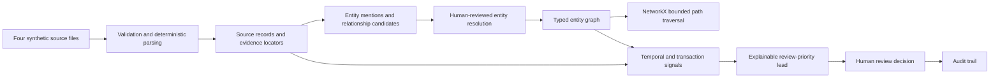

# VEIL — SIH first-round technical evidence

## Selection claim

VEIL converts controlled, authorized investigation-style records into an evidence-backed entity graph and surfaces explainable investigative leads. It generates leads, not accusations.

Every graph edge and analytical signal in the judge flow links to exact synthetic source evidence. Human reviewers decide whether a proposed identity match or lead is useful. Review actions are recorded in an append-only application journal.

## Demonstrated system boundary



The React frontend displays backend results. It does not independently calculate entity-resolution scores, graph paths, signals or lead priority.

## What the prototype proves

| Judge-visible output | Implementation evidence | Traceability evidence |
|---|---|---|
| Four processed source types | FastAPI controlled ingestion for report text, CDR CSV, transaction CSV and vehicle CSV | Source manifests contain filename, type, checksum, parser version, record count, state and validation errors |
| Explainable alias proposal | Deterministic normalization, blocking and weighted feature comparison | Name, exact shared phone and shared vehicle features open their source records |
| Reversible identity confirmation | SQLite records human decisions; graph queries use a canonical projection | Original Rahul and R.K. Sharma mentions remain preserved; undo restores separation |
| Rahul–Vikram connection | NetworkX computes a bounded shortest association path at request time | Six relationships carry evidence IDs and explicit traversal directions |
| Lead 17 | Backend combines communication, financial and graph-context categories under a documented priority policy | Each calculation exposes evidence IDs, algorithm version, window, threshold and limitations |
| Human review loop | Review submission persists in SQLite with idempotency handling | Audit shows actor, reason, object and old/new state |

## Computed demonstration facts

- Communication baseline: median 2 calls per day over the documented seven-day baseline.
- Event-day activity: 11 calls.
- New contacts: 7 contacts absent from the baseline.
- Financial sequence: 3 connected transfers totalling INR 195,000 over 75 minutes, within the configured 90-minute window.
- Graph context: a six-hop association path between Rahul Kumar Sharma and Vikram Singh.
- Priority: HIGH because three traceable categories overlap. This is an examination-order policy, not a crime probability.

## API evidence

Captured JSON responses are stored under [`artifacts/first-round/api`](../../artifacts/first-round/api). Important files:

- `case.json`: case identity and counts.
- `sources.json`: four processed source manifests.
- `resolution.json`: match proposals and feature explanations.
- `graph.json`: typed nodes, edges and evidence IDs.
- `path.json`: computed six-hop path and method.
- `lead-17.json`: generated lead and signal calculations.
- `evidence.json`: exact transaction row provenance.
- `reviews.json`: persisted human reviews.
- `audit.json`: append-only activity history.
- `timeline.json`: unified source and system timeline.

These exports are evidence artifacts only. The application does not load them as a hidden fallback.

## Verification record

- Backend: 98 tests passed; two existing dependency deprecation warnings.
- Frontend: lint, type checking and production build passed.
- Browser: four Playwright flows passed, covering the golden judge route, backend-error recovery, graph controls, filters, responsive layouts, evidence continuity, report extraction and behavioral-profile integration.
- Tested viewport widths: 1366, 1440, 1920 and 768 pixels.
- Golden smoke: zero console errors, zero failed requests and zero external requests.
- Production build is served by the same local FastAPI process; no external AI API is required for the primary judge route.

See [`artifacts/redesign/golden-flow-verification.json`](../../artifacts/redesign/golden-flow-verification.json), [`artifacts/redesign/redesign-verification.json`](../../artifacts/redesign/redesign-verification.json) and [`artifacts/redesign/smoke-results.json`](../../artifacts/redesign/smoke-results.json).

## Evidence boundaries

This evaluation uses planted synthetic scenarios and does not estimate real-world accuracy. A graph path is a sequence of recorded associations, not proof of coordination. An anomaly is statistical divergence, not crime. A community is a graph partition, not a criminal organization. A central node is not automatically a leader. Review priority is not guilt probability. Unverified extracted claims remain labelled and require review.

Reviewer identity is self-declared in this local prototype. Audit events are append-only through normal application behavior but are not cryptographically tamper-resistant. Authentication, authorization policy, encryption, production deployment and real-agency validation remain future work.

## Reproducible commands

```powershell
cd 'Z:\XLab\New\Network Intel\frontend'
npm ci
npm run lint
npm run typecheck
npm run build
cd ..
.\.venv\Scripts\python.exe -m pytest -q
.\.venv\Scripts\python.exe -m backend.serve_demo --reset --port 8000
```

Open `http://127.0.0.1:8000/`. Stop the running server before using `--reset`; the launcher archives the dedicated rehearsal databases first.
